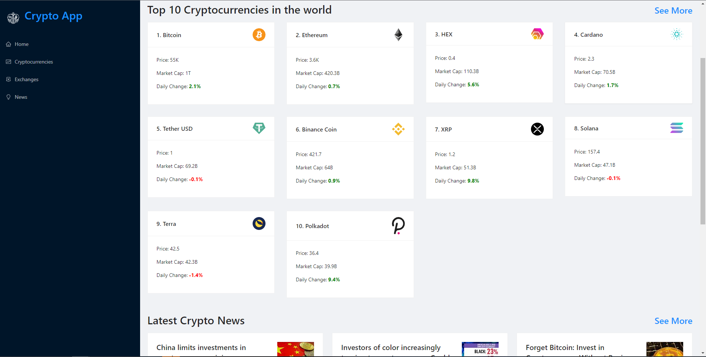

# Crypto App

## **Project Description**
Cryptocurrency website where you can view up-to-date news about various cryptocurrencies and keep track of daily changes in prices and movement of prices over select time periods.
 

## **Motivation**

My motivation for this app was to create a dynamic website using React where I could simply open up the site and be able to keep track of the cryptocurrencies I was interested in. I also wanted to learn more about **react-redux** and **rapidapi.**
 
## **Technologies Used:**
- Ant Design
- react-redux
- Axios
- Chart.js
- react-chart-js-2
- Rapidapi

 
## **Additional Features**
Ability to sort news by specific cryptocurrency in the "news" section as well as selecting a specific cryptocurrency to get more in-depth information about it.

Table of various exchanges showing a brief description, 24h trade volume, markets, and market share.
 
## **What I learned**
I learned an incredible amount about react-redux in this project and specifically the **reduxjs toolkit**. This toolkit allowed me to easily connect to my endpoints, create APIs with ease, and fetch data from them.

I also used **Ant Design** for the first time in this project which is a very comprehensive framework that had most, if not everything that I needed for the visual side of this project. I chose to use Ant Design because I wanted to work with a framework I hadn't worked with before to see if it could offer anything better than the frameworks I was already familiar with.

**RapidApi.** Just an incredible API that allows you to quickly and easily connect to thousands of APIs. This was also my first time working with RapidApi and i was pleasantly surprised. Usually it's a bit of a headache to figure out how to retrieve information from various individual APIs, but RapidApi allows you access to APIs that has already done the heavy lifting for you.
 
 
 
# Getting Started with Create React App

This project was bootstrapped with [Create React App](https://github.com/facebook/create-react-app).

## Available Scripts

In the project directory, you can run:

### `npm start`

Runs the app in the development mode.\
Open [http://localhost:3000](http://localhost:3000) to view it in the browser.

The page will reload if you make edits.\
You will also see any lint errors in the console.

### `npm test`

Launches the test runner in the interactive watch mode.\
See the section about [running tests](https://facebook.github.io/create-react-app/docs/running-tests) for more information.

### `npm run build`

Builds the app for production to the `build` folder.\
It correctly bundles React in production mode and optimizes the build for the best performance.

The build is minified and the filenames include the hashes.\
Your app is ready to be deployed!

See the section about [deployment](https://facebook.github.io/create-react-app/docs/deployment) for more information.

### `npm run eject`

**Note: this is a one-way operation. Once you `eject`, you can’t go back!**

If you aren’t satisfied with the build tool and configuration choices, you can `eject` at any time. This command will remove the single build dependency from your project.

Instead, it will copy all the configuration files and the transitive dependencies (webpack, Babel, ESLint, etc) right into your project so you have full control over them. All of the commands except `eject` will still work, but they will point to the copied scripts so you can tweak them. At this point you’re on your own.

You don’t have to ever use `eject`. The curated feature set is suitable for small and middle deployments, and you shouldn’t feel obligated to use this feature. However we understand that this tool wouldn’t be useful if you couldn’t customize it when you are ready for it.

